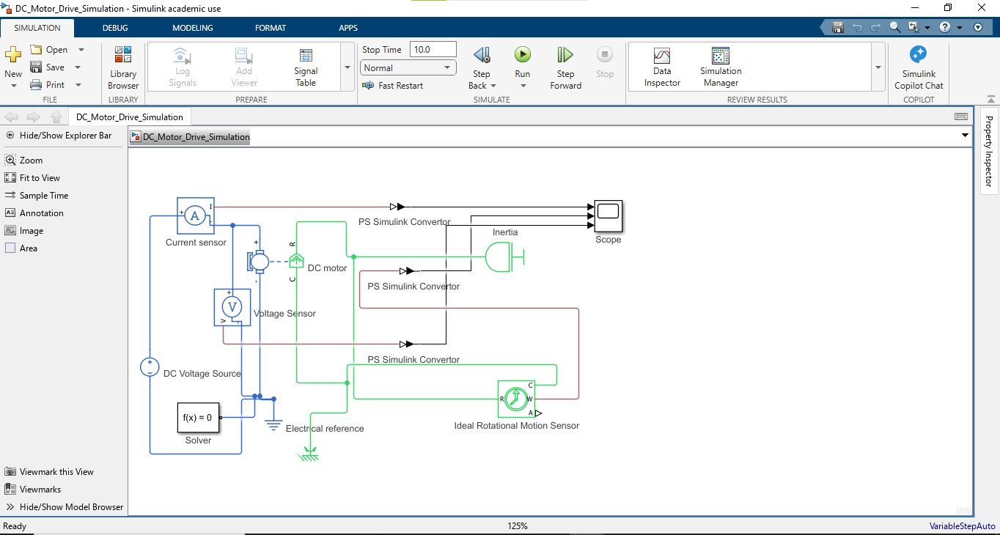
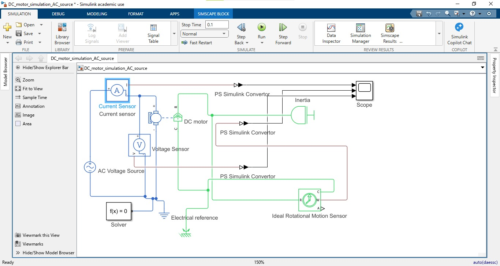
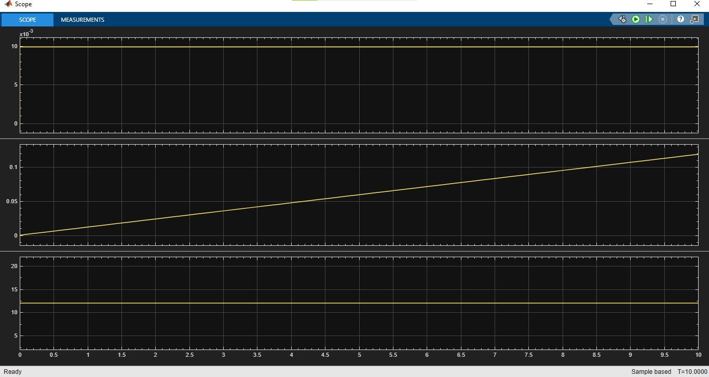
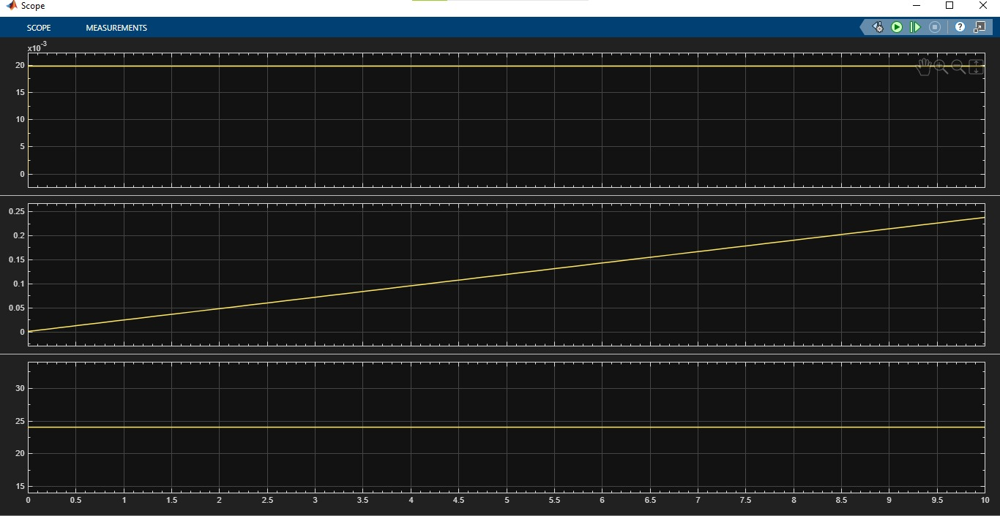
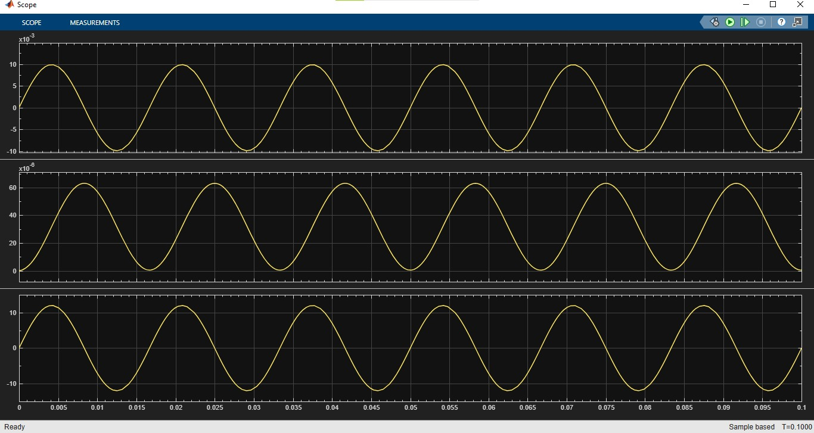
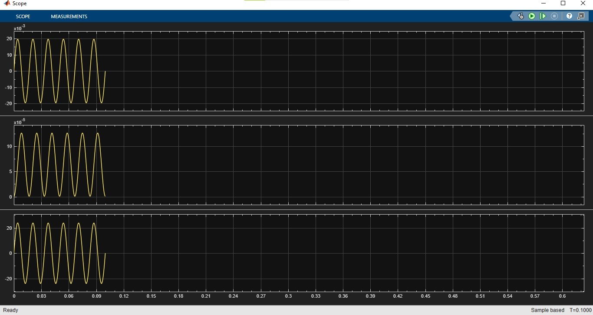

# DC Motor Simulation using MATLAB Simulink and Simscape

## Overview

This project demonstrates the modeling and simulation of a Permanent Magnet DC (PMDC) Motor using MATLAB Simulink and Simscape Electrical. The project investigates the electrical and mechanical characteristics of the motor under different supply conditions.

The simulation includes:

- DC Source (12 V)
- DC Source (24 V)
- AC Source (for comparison)

Motor voltage, current, and rotational motion are measured and analyzed using Simscape sensors and Simulink Scope blocks.

---

## Features

- PMDC motor modeling using Simscape
- DC motor simulation with 12 V supply
- DC motor simulation with 24 V supply
- AC source comparison
- Voltage measurement
- Current measurement
- Rotational motion measurement
- Inertia (mechanical load) modeling
- Real-time waveform visualization using Scope

---

## Software Used

- MATLAB R2026a
- Simulink
- Simscape
- Simscape Electrical

---

## Components Used

- AC Voltage Source
- DC Voltage Source
- Current Sensor
- Voltage Sensor
- Permanent Magnet DC Motor
- Ideal Rotational Motion Sensor
- Inertia
- Mechanical Rotational Reference
- Electrical Reference
- Solver Configuration
- PS-Simulink Converter
- Scope

---

## Project Structure

```
DC-Motor-Simulation/
│
├── README.md
├── DC_Motor_Drive_Simulation.slx
├── AC_Motor_Comparison.slx
│
├── Images/
│   ├── Simulink_image_DC_source.jpeg
│   ├── dc_voltage_12v_output.jpeg
│   ├── Dc_voltage_24v_output.jpeg
│   ├── simulink_image_AC_source.jpeg
│   ├── Ac_voltage_12v_output.jpeg
│   └── Ac_voltage_24v_output.jpeg
│
└── Report/
    └── DC_Motor_Report.pdf
```

---

# Simulink Model (DC Source)

*(Add the image below)*



---

# Simulink Model (AC Source)

*(Add the image below)*


---

# Simulation Cases

## Case 1 – DC Supply (12 V)

### Objective

To observe the motor voltage, current, and speed when supplied with a 12 V DC source.

### Observations

- Constant supply voltage of 12 V
- Current reaches steady state after startup
- Motor speed increases and stabilizes

---

## Output

*(Insert image)*



---

## Case 2 – DC Supply (24 V)

### Objective

To compare the motor performance when the supply voltage is increased to 24 V.

### Observations

- Supply voltage increases to 24 V
- Higher armature current
- Increased motor speed
- Higher developed torque

---

## Output

*(Insert image)*




---

## Case 3 – AC Supply

### Objective

To observe the behavior of a PMDC motor when directly supplied with an AC voltage source.

### Observations

- Voltage and current become sinusoidal.
- Torque changes direction every half cycle.
- The PMDC motor does not achieve smooth continuous rotation.
- The simulation demonstrates why PMDC motors require a DC supply or a rectified AC source.

---

## AC Output

### 12 V AC



### 24 V AC



---

# Results

## DC Supply

- Constant output voltage
- Stable motor operation
- Smooth increase in rotational speed
- Suitable for PMDC motors

## AC Supply

- Sinusoidal voltage and current
- Oscillating motor response
- No steady unidirectional rotation
- Demonstrates the need for AC-to-DC conversion when using PMDC motors

---

# Comparison

| Parameter | 12 V DC | 24 V DC | AC Source |
|------------|----------|----------|-----------|
| Voltage | Constant | Constant | Sinusoidal |
| Current | Lower | Higher | Alternating |
| Motor Speed | Lower | Higher | Oscillatory |
| Torque | Lower | Higher | Alternating |
| Suitable for PMDC | Yes | Yes | No |

---

# Learning Outcomes

Through this project, I gained practical experience in:

- MATLAB Simulink modeling
- Simscape Electrical
- Permanent Magnet DC Motor modeling
- Sensor integration
- Voltage measurement
- Current measurement
- Rotational motion measurement
- Mechanical load (Inertia) modeling
- PS-Simulink signal conversion
- Analysis of DC and AC motor supply characteristics
- Simulation-based performance comparison

---

# Applications

- Industrial Automation
- Robotics
- Electric Vehicles
- Conveyor Systems
- Mechatronics
- Educational Simulation
- Embedded Control System Design

---


### Skills

MATLAB • Simulink • Simscape • Embedded C • STM32 • ESP32 • RTOS • Embedded Systems
